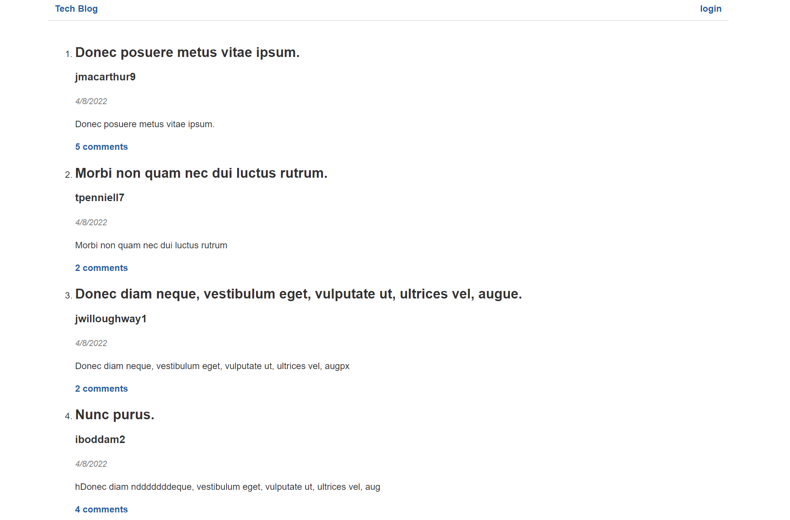
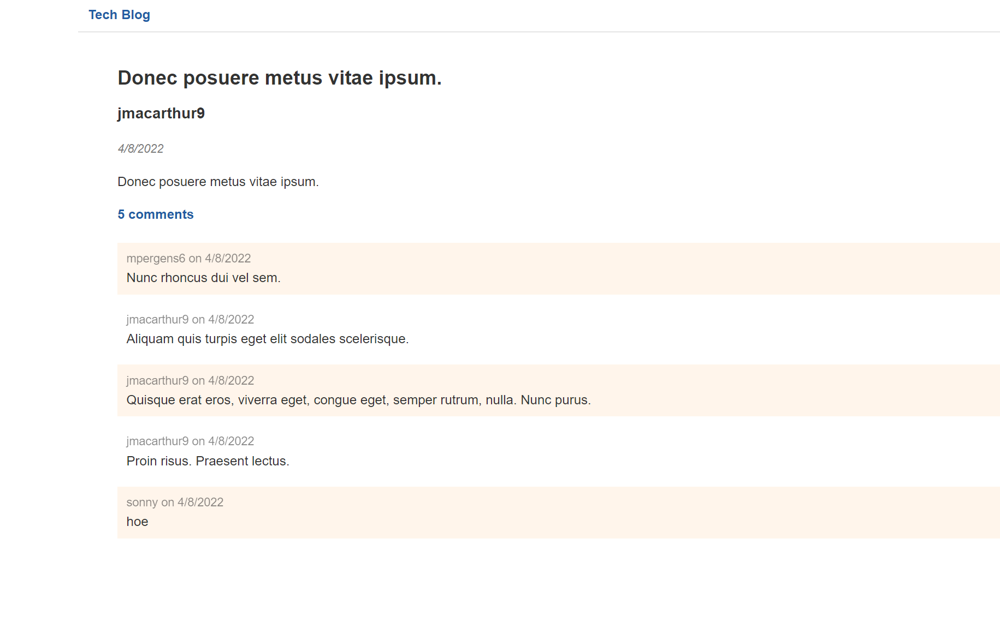
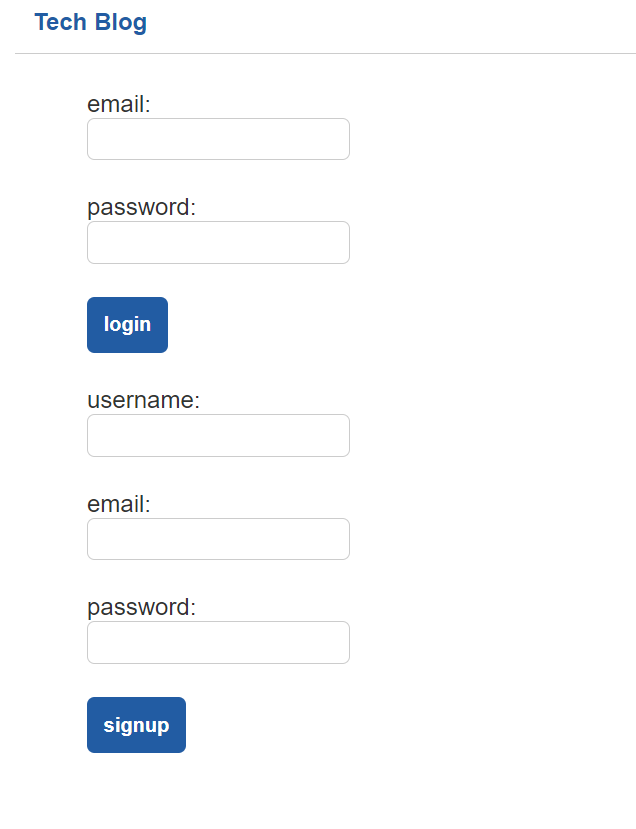
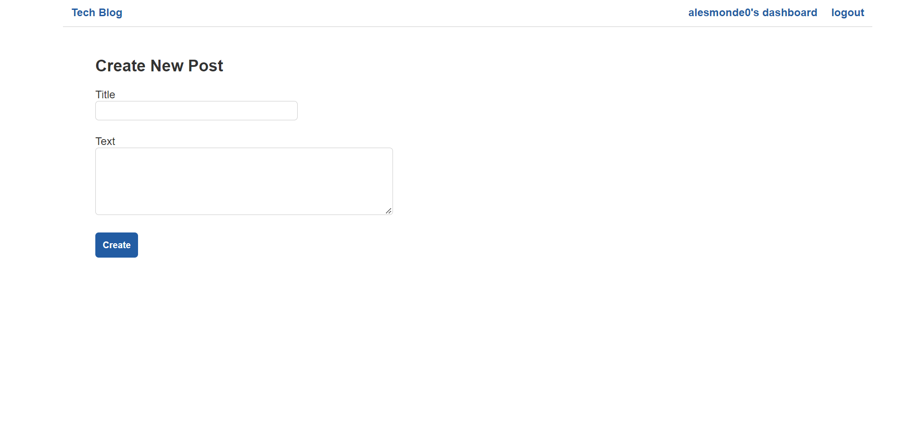
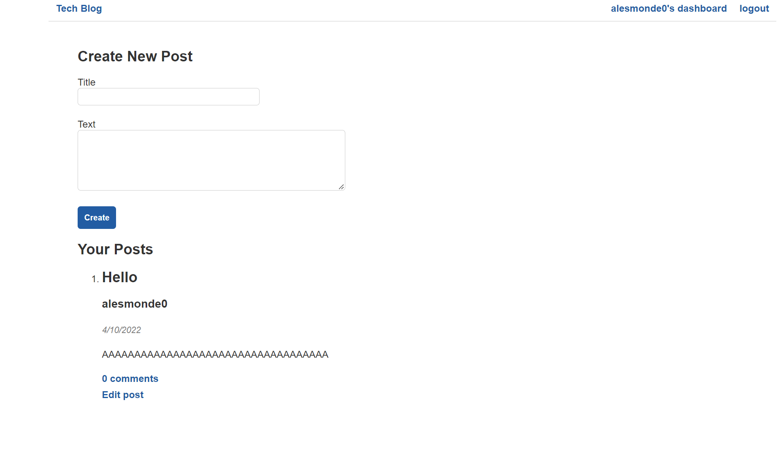
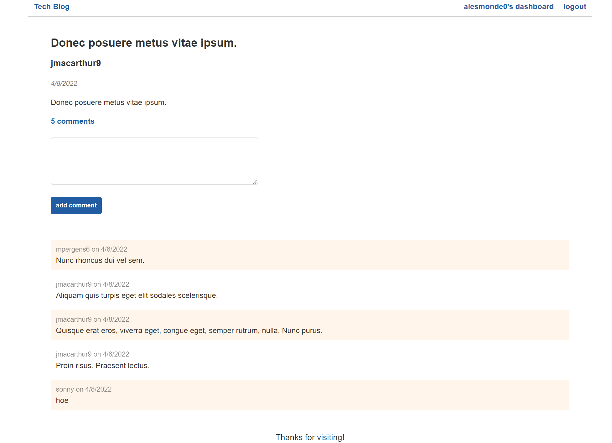

# MVC-TECH-BLOG

LINK TO DEPLOYED SITE:

For this assignment, the task was to create a tech blog from scratch where users would be able to create accounts and post from said accounts to the main page. This would require 3 tables to generate the API calls necessary for the app: Users, posts, and comments.

## Installation 

Required packages: 
- sequelize
- connect-session-sequelize
- dotenv
- MySQL2
- express-session
- express-handlebars
- bcrypt

After cloning the repo and installing NPM packages above, run the following from the root directory in the terminal:

- mysql -u root -p

After entering password...

- source db/schema.sql
- quit

After database is created...

- npm run seed
- npm start (kicks off server locally)

## Use

When entering the site for the first time, the user is taken to the home page where all posts are listed.

For each post, there are comments other users can put there which can be seen if clicking on the highlighted comments text.

In order for a user to post/comment, they must create an account. This can be done by pressing the login button at the top right of the site.

Once created, they will immediately be taken to the Create New Post page (also accessed through their dashboard at the very top of the screen)

If not filling in the Text and Title fields, the site will yell at the user. Once the CREATE button is pressed, the dashboard will reload updated with the post(s) below. Here you can also edit posts that are YOURS, as well as comment on your post.

Going back to the home page when signed in, you can also leave comments on every post listed.

